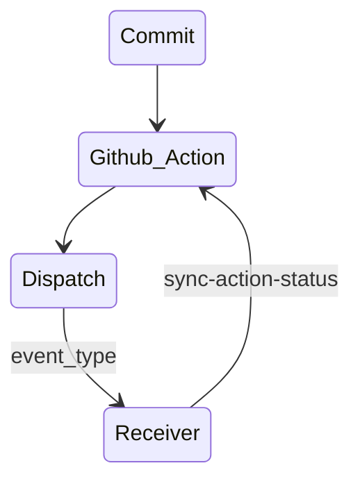

# sync-action-status

[](https://github.com/philipdelorenzo/sync-action-status/actions/workflows/run_tests.yml)

A GitHub Action to follow `repository_dispatch` runs in your local repo...

This Github Action currently only works with repos that you own. If you are calling a repo that is in the same org or owned by the same
Github User, this Action will sync the Workflow Status of a `repository_dispatch`.

Please see [Repository Dispatch](https://github.com/marketplace/actions/repository-dispatch) if you'd like to read up on what a repository dispatch is, and what it does.

## How this works



## Usage

To begin installing, see [Sync-Action-Status-Install](#sync-action-status-install)

To use this Action, there are multiple parts to setup within your Github Action. The process can seem somewhat difficult, as there are multiple repos involved and calling another repo to run an action can be somewhat confusing. The reason for this action is mainly for SRE/Platform/DevOps Engineers. There are times when we want to keep Actions in one place - for a number of reasons:

1. Security _(are there any reasons why you would want to keep the functionality of the action secret, this can help)_
2. SRE can engage with Dev teams with minimal interuptions
    - Let's face it, Development is tough, and developers are busy. Putting all of the Actions in a Repo to run from allows the SRE team to iterate, build, augment Actions without interupting developer's with constant PR requests and extra code bloat in their repo_(s)_.
3. My personal favorite, it allows us to remain in Github - 
    - In some cases, there are needs for other services like CircleCI, Buildkite, etc. but if we can remain in Github, this is always a plus. It's less cost _(why pay for another service if you already have a service deployed that can do the same thing?)_, and less context switching - These days, Platform Engineers end up working tirelessly just gluing together the plethora of services utilized by their development teams.

## Prerequisites

In order to accomplish this, you will need to create a new repo that will house your `dispatch_receivers`. These are the Github Actions that are triggered from other repos by using `event_types`. When an event type is sent to the repo, the receiver is triggered, and the Action is deployed.

- `GITHUB_TOKEN` - It is imperative that you setup a Github Token _(PAT)_ for making the calls in between repos, etc.
    - NOTE: Make sure to add this token to the Action Secrets. You will call the GH_TOKEN using `${{ secrets.GH_TOKEN }}`.

## Sync-Action-Status Install

#### Target Repository

Add the following as a job step:

```yaml
- name: Set Target Dispatch Repository
    id: target
    run: |
    echo "target=${{ github.repository_owner }}/<your-repository-dispatch-repo>"
    echo "target=${{ github.repository_owner }}/<your-repository-dispatch-repo>" >> $GITHUB_OUTPUT
```

#### Sending the API Call

Add the following as a job step:

```yaml
# The target step sets the repo that you're calling that houses the Repository Dispatch Receiver
- name: Send a Dispatch to the Test Receiver
  run: |
    curl -H "Content-Type: application/json" -H "Authorization: token ${{ secrets.GH_TOKEN }}" -H "Accept: application/vnd.github.everest-preview+json" -d "{\"event_type\": \"${EVENT_TYPE}\"}" "https://api.github.com/repos/${{ steps.target.outputs.target }}/dispatches"
```

#### Tail the Repository Dispatch in your Calling Repo

```yaml
- uses: philipdelorenzo/sync-action-status@<version>
    with:
    gh_token: ${{ secrets.GH_TOKEN }} # Add this token to your Github Action Secrets
    event_type: <repository-dispatch-event-type>
    current_repo: ${{ github.repository }}
    # You must use this action ONLY with repositories that you own
    target_repo: "${{ steps.target.outputs.target }}"
    debug: ${{ github.event.inputs.debug }} # See below step for setting up debug mode
```

The above snippet is what follows the Github Action that is running in the repository dispatch receiver.

### Setup Action with Debug Mode

The action uses [icecream](https://github.com/gruns/icecream) for running in debug mode.

To set this up in your Github Action Workflow, you can add a boolean input:

```yaml
on: 
  workflow_dispatch:
    inputs:
      debug:
        description: 'Run the workflow in debug mode'
        required: false
        type: boolean
        default: false
```
